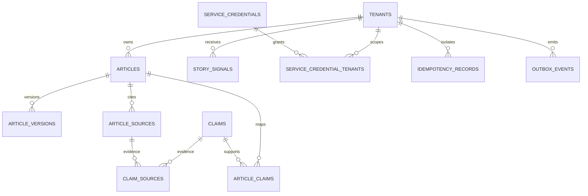

# Data model baseline

`article_versions` and `audit_events` are append-only/immutable at the database layer. `idempotency_records` owns durable command replay state. `outbox_events` separates committed state from external cache/distribution side effects.

Retention periods are intentionally not invented here: source snapshots, contact data, audit history and generated media require policy/legal decisions before hard-coded deletion windows are introduced.
